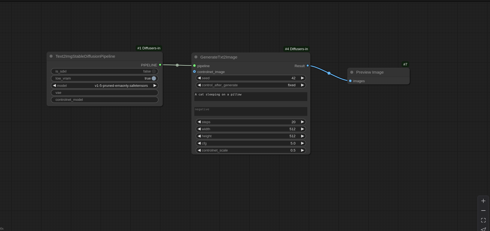
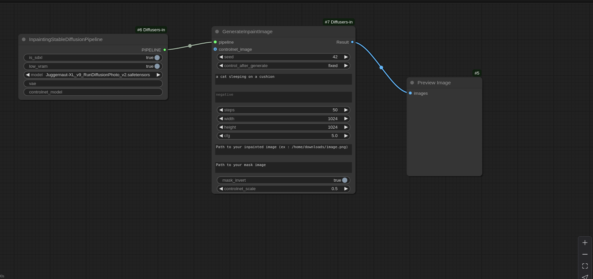
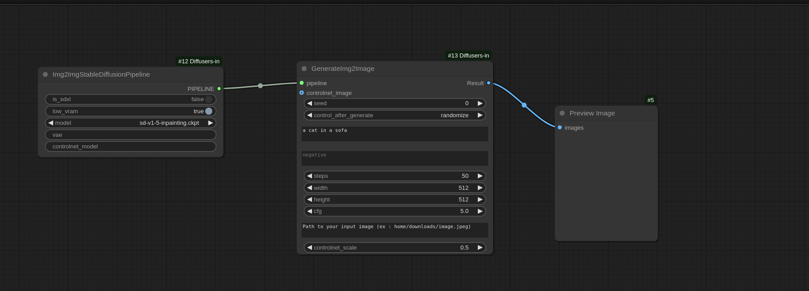
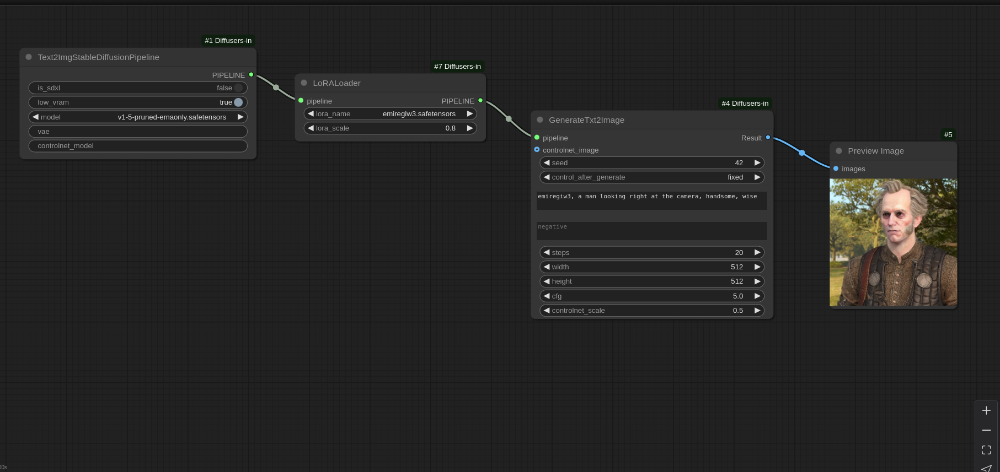
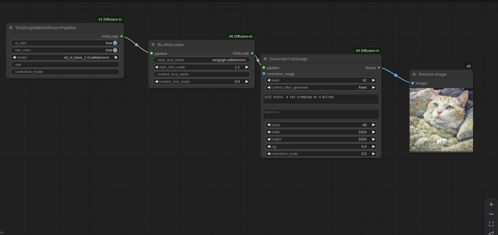

# 🎨 Diffusers in ComfyUI

> Bring the full power of Hugging Face Diffusers pipelines directly into ComfyUI

[](https://github.com/ltdrdata/ComfyUI-Manager)
[](https://registry.comfy.org/)
[](https://github.com/maepopi/Diffusers-in-ComfyUI/stargazers)
[](https://opensource.org/licenses/MIT)

---

## ✨ Features

- 🔥 **Full Diffusers Pipeline Integration** - Text2Img, Img2Img, and Inpainting pipelines
- 🎯 **SDXL Support** - Works with both SD 1.5 and SDXL models
- 🎨 **ControlNet Compatible** - Seamless ControlNet integration with any Hugging Face model
- 🧩 **LoRA & B-LoRA Support** - Load LoRAs and advanced B-LoRAs for style/content separation
- ⚡ **Low VRAM Mode** - Optimized for limited GPU memory with CPU offloading
- 🛠️ **Modular Design** - Clean, reusable nodes for flexible workflows
- 📦 **Easy Installation** - Available via ComfyUI Manager and Comfy Registry

---

## 🚀 Quick Start

### Option 1: Install via Comfy Registry (Recommended)

```bash
comfy node registry-install diffusers-in-comfyui
```

### Option 2: Install via ComfyUI Manager

1. Launch ComfyUI
2. Open ComfyUI Manager
3. Search for "Diffusers in Comfy UI"
4. Click Install

### Option 3: Manual Installation

```bash
cd ComfyUI/custom_nodes/
git clone https://github.com/maepopi/Diffusers-in-ComfyUI.git
cd Diffusers-in-ComfyUI
pip install -r requirements.txt
```

After installation, you'll find the nodes under **"Diffusers-in-Comfy"** in your node menu! 🎉

---

## 📖 Usage

### Available Node Categories

#### 🔧 Pipeline Nodes (`Diffusers-in-Comfy/Pipelines`)

Set up your generation pipeline with these nodes:

- **Text2ImgStableDiffusionPipeline** - Generate images from text prompts
- **Img2ImgStableDiffusionPipeline** - Transform existing images
- **InpaintingStableDiffusionPipeline** - Fill masked regions

**Pipeline Configuration Options:**
- ✅ SDXL support toggle
- 🎨 Custom VAE (e.g., `"stabilityai/sd-vae-ft-mse"`)
- 🕹️ ControlNet integration (e.g., `"XLabs-AI/flux-controlnet-canny"`)
- 💾 Low VRAM mode for memory-constrained GPUs

#### 🎯 Inference Nodes (`Diffusers-in-Comfy/Inference`)

Execute your generation with fine-tuned control:

- **GenerateTxt2Image** - Text-to-image generation
- **GenerateImg2Image** - Image-to-image transformation
- **GenerateInpaintImage** - Inpainting with masks

**Common Parameters:**
- Seed, Positive/Negative prompts
- Inference steps, Width/Height
- Guidance scale
- ControlNet image & scale

#### 🛠️ Utils Nodes (`Diffusers-in-Comfy/Utils`)

Image preprocessing utilities:

- **Make Canny** - Convert images to Canny edge maps for ControlNet
  - Outputs: Processed image + Preview

#### 🧩 Component Nodes (`Diffusers-in-Comfy/Components`)

Extend your pipelines with adapters:

- **LoraLoader** - Load LoRA adapters with custom weights
- **BLoRA** - Advanced style/content separation (SDXL only)
  - ⚠️ Note: B-LoRA works with ControlNet but not with standard LoRAs

---

## 📸 Workflow Examples

### Text-to-Image (SD 1.5)


### Inpainting (SDXL)


### Image-to-Image (SD 1.5)


### LoRA Integration


### B-LoRA Style Transfer (SDXL)


---

## 🎯 Advanced: B-LoRA Usage

B-LoRA enables powerful style and content separation. [Original paper](https://github.com/yardenfren1996/B-LoRA)

**Setup:**
1. Place your B-LoRA file in `ComfyUI/lora/` folder
2. In the BLoRA node, specify filename (e.g., `vangogh.safetensors`)
3. Ensure SDXL pipeline is loaded with `is_sdxl=True`

**Important Notes:**
- ✅ Compatible with ControlNet
- ❌ Cannot be combined with standard LoRAs
- 🎨 SDXL models only

---

## 🗺️ Roadmap

- [ ] IPAdapter support
- [ ] Automatic model architecture detection via ComfyAPI
- [ ] Local & remote model loading with URL support
- [ ] File browser for image selection (no manual paths)
- [ ] Auto-strip quotes from input paths
- [ ] Auto-detect B-LoRAs in lora folder
- [ ] More research paper implementations 🔬

---

## 🙏 Acknowledgments

This project was inspired by [ComfyUI-Diffusers](https://github.com/Limitex/ComfyUI-Diffusers). Special thanks to:
- **Comfy Registry team** for platform inclusion
- **ltdrdata** for ComfyUI Manager integration
- The ComfyUI community for continuous feedback

---

## 🤝 Contributing

Contributions, issues, and feature requests are welcome!

Feel free to check the [issues page](https://github.com/maepopi/Diffusers-in-ComfyUI/issues) or submit PRs.

---

## 📝 License

This project is [MIT](LICENSE) licensed.

---

## 💬 Contact & Support

- 🐛 [Report a bug](https://github.com/maepopi/Diffusers-in-ComfyUI/issues)
- 💡 [Request a feature](https://github.com/maepopi/Diffusers-in-ComfyUI/issues)
- ⭐ [Star this repo](https://github.com/maepopi/Diffusers-in-ComfyUI) if you find it useful!

---

<div align="center">
Made with ❤️ for the ComfyUI community
<br><br>
<sub>README documentation written with assistance from Claude AI</sub>
</div>
